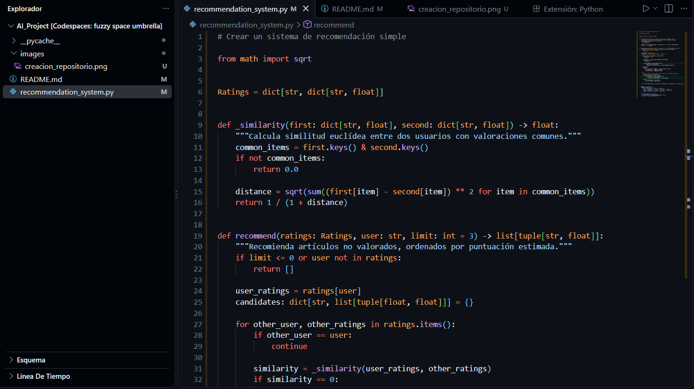
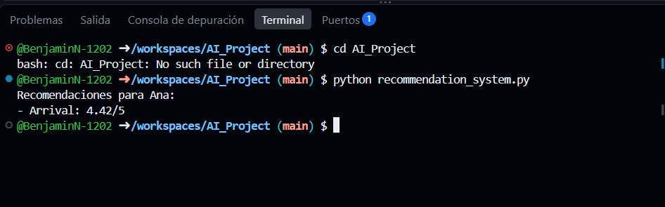

# AI_Project

# Proyecto: Sistema de Recomendación Simple

Este proyecto fue desarrollado como parte de la actividad formativa de GitHub Copilot en Inacap.

El objetivo es explorar cómo GitHub Copilot puede ayudar a generar código relacionado con las tendencias emergentes en Inteligencia Artificial.

---

## Pasos realizados

### 1. Cuenta de GitHub y Copilot
Ingresé a https://github.com/, creé mi cuenta, validé mi correo electrónico y activé GitHub Copilot con el plan gratuito.

### 2. Creación del repositorio
En el Dashboard hice clic en **New** y creé el repositorio `AI_Project`, de visibilidad pública, con un archivo README.


### 3. Entorno de trabajo
En lugar de clonar el repositorio de forma local, lo abrí en **GitHub Codespaces** (Code → Codespaces → Create codespace on main). Esto abre Visual Studio Code en el navegador con el repositorio ya clonado, por lo que no fue necesario ejecutar `git clone`.

### 4. Creación del archivo de código
Dentro del Codespace creé el archivo `recommendation_system.py`.

### 5. Generación del código con GitHub Copilot
Usé GitHub Copilot con la instrucción "Crear un sistema de recomendación simple". Copilot generó un sistema de recomendación basado en similitud euclídea entre usuarios.



### 6. Ejecución del programa
Ejecuté el programa desde el terminal integrado:

```bash
python recommendation_system.py
```



### 7. Documentación
Creé este archivo `README.md` para documentar el proceso, con capturas y una descripción de cada paso.

### 8. Commit y push
Subí los cambios al repositorio remoto con los siguientes comandos:

```bash
git add .
git commit -m "Add recommendation system example"
git push -u origin main
```

---

## Cómo funciona el código

El archivo `recommendation_system.py` contiene dos funciones principales:

- `_similarity(first, second)`: calcula la similitud entre dos usuarios usando la distancia euclídea sobre las películas que ambos valoraron. El resultado es `1 / (1 + distancia)`, así que un valor más cercano a 1 indica mayor similitud.
- `recommend(ratings, user, limit=3)`: recomienda películas que el usuario aún no ha valorado, calculando un promedio ponderado de las valoraciones de los demás usuarios según su similitud. Si no hay usuarios similares, recomienda las películas mejor valoradas en general.

### Ejemplo de resultado

```text
Recomendaciones para Ana:
- Arrival: 4.42/5
```

Ana no ha visto *Arrival*, y los usuarios más parecidos a ella (como Luis) la valoraron muy bien, por eso el sistema se la recomienda.

---

## Tecnologías

- Python 3
- GitHub Copilot
- GitHub Codespaces
- Git y GitHub